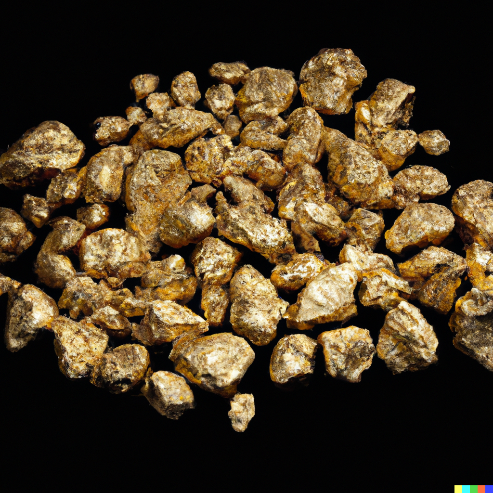
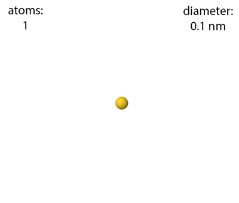

<NuggetArea>
<Nugget slug="/my-first-lode/another-category/subcategory1/image-test" type="nugget" _key="bec302f5-f1cf-4d99-8b60-b2da8506ccac" _id="nugget/bec302f5-f1cf-4d99-8b60-b2da8506ccac" _rev="_iFflGz2---" tag="imagetest" fspath="examples/my-mine/my-first-lode/another-category/subcategory1/imagetest.md" label="Image Test" paths="/my-first-lode/another-category/subcategory1/image-test">
<NuggetBody>
### Image Test

This is a test of including an image in a nugget:

***

 

</NuggetBody>
<Breadcrumbs>
<Crumbs>
<Crumb _key="08bcf93d-ed39-4d34-889b-5d3271074f7c" label="My First Lode" /><Crumb _key="12019882" label="another-category" /><Crumb _key="12019885" label="subcategory1" />
</Crumbs>
</Breadcrumbs>
</Nugget>

<NuggetsInbound>
</NuggetsInbound>
<NuggetsOutbound>
</NuggetsOutbound>
</NuggetArea>
<PassagesInbound>
<Passage direction="inbound" type="passage" _key="12019885" _id="passage/12019885" _rev="_iFflGzy---" label="subcategory1" passage="subcategory1" fspath="examples/my-mine/my-first-lode/another-category/subcategory1" paths="/my-first-lode/another-category/subcategory1" slug="/my-first-lode/another-category/subcategory1">
<NuggetBody>
### subcategory1

</NuggetBody>
<Breadcrumbs>
<Crumbs>
<Crumb _key="08bcf93d-ed39-4d34-889b-5d3271074f7c" label="My First Lode" /><Crumb _key="12019882" label="another-category" />
</Crumbs>
</Breadcrumbs>
</Passage>

</PassagesInbound>
<PassagesOutbound>
</PassagesOutbound>